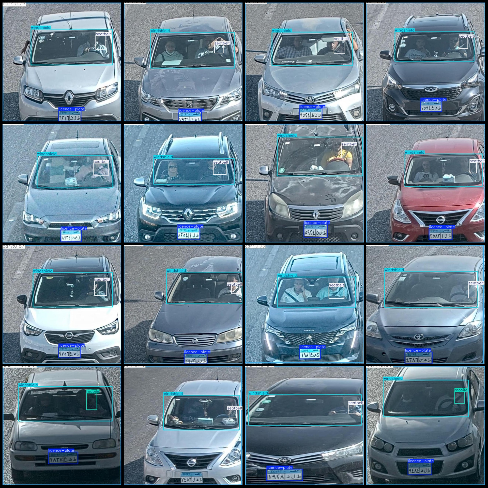
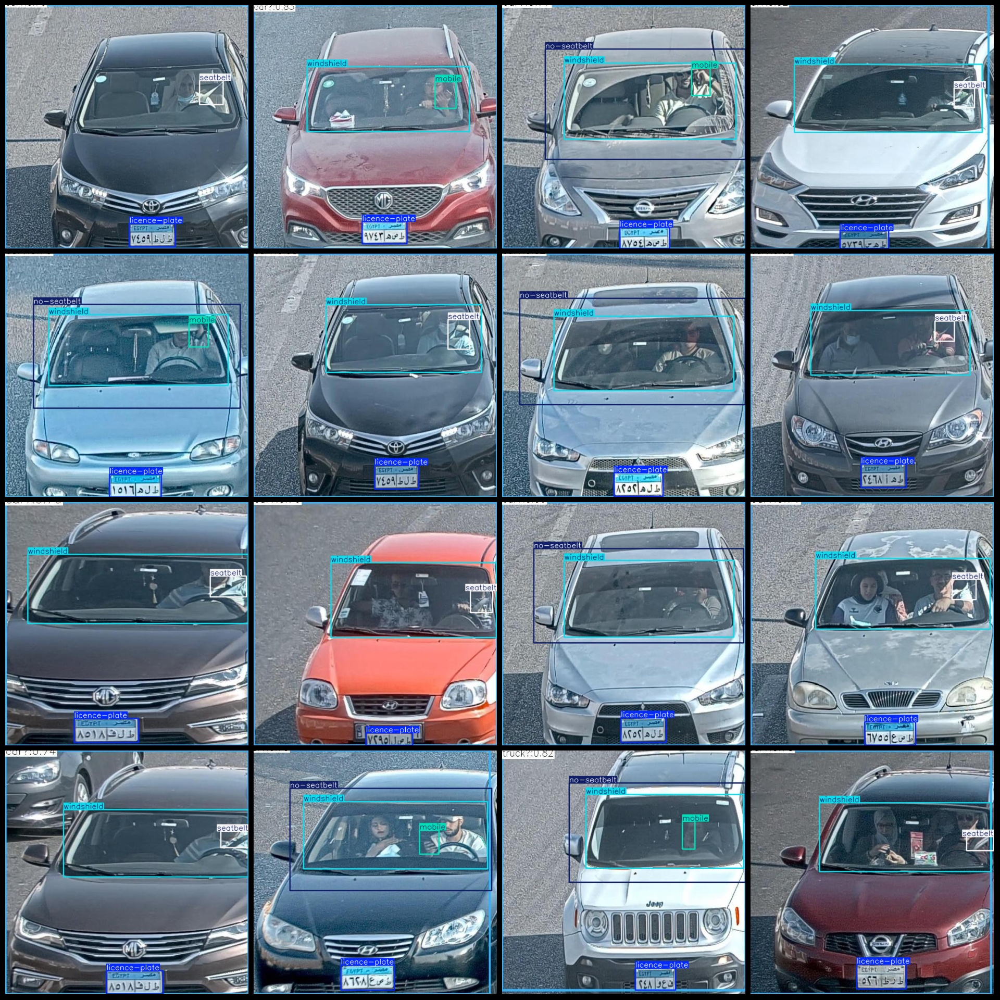

# Smart Traffic Driver Ignorance of Seat Belts and Mobile Phone Handling Detection Data Set VOC+YOLO Format 803 Categories

The dataset format is Pascal VOC format+YOLO format (the txt file does not include the split path, only contains jpg images and corresponding VOC format xml files and yolo format txt files).
Number of images (jpg file count): 803
annotation count: 803  
annotation count: 803  
annotationnumber of classes: 5  
annotation class names: ["licence-plate", "mobile", "no-seatbelt", "seatbelt", "windshield"]
boxes per class:   
License plate box count = 783  
Mobile phone box count = 345
The number of no-seatbelt (no seat belt) cases = 250
The seatbelt (seat-belt) box count is 486.
The windshield box count is 799.
total boxes: 2663  
images per class:   
License plate images = 783
Mobile images = 344
No seatbelt images = 250
Seatbelt images = 485
Windshield images = 798
Resolution of the image: 640x640
Use annotation tool: labelImg.
Annotation rules: draw a rectangle around the class.
important notes: Dataset has not been divided into training, validation, and test sets. Please divide them yourself.
Special Disclaimer: This dataset does not guarantee the accuracy of the trained model or the weights file.
image preview:
## Images

Here is a pay link on Stripe ( https://buy.stripe.com/3cs8yP7sY87d0vu9AB ). Please contact me lonlonago@foxmail.com after funding $89, and I will send you a complete data files , thank you!

